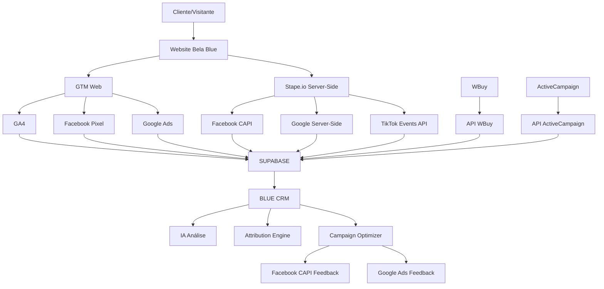

# 🎯 VISÃO ESTRATÉGICA: CRM COM TRACKING COMPLETO E UNIFICADO

## 🚀 **OBJETIVO ESTRATÉGICO**

Criar um **CRM de Gerenciamento Total** que unifica TODOS os dados da empresa, fazendo tracking interno e externo completo, com validação cruzada e otimização automática de campanhas via Server-Side.

## 🌐 **ARQUITETURA DO SISTEMA COMPLETO**

### 📊 **FONTES DE DADOS INTEGRADAS**



### 🎯 **FLUXO DE DADOS E VALIDAÇÃO**

#### 1. **📥 COLETA DE DADOS (Anti-Ad Blocker)**
```typescript
interface DataCollection {
  // Dados que ad blockers NÃO conseguem bloquear
  stapeServerSide: {
    real_ip: string;
    encrypted_client_id: string;
    facebook_capi: FacebookData;
    google_server_side: GoogleData;
    tiktok_events: TikTokData;
    geo_location: GeoData;
    device_fingerprint: DeviceData;
  };
  
  // Dados tradicionais (podem ser bloqueados)
  webGTM: {
    ga4_data: GA4Data;
    facebook_pixel: FacebookPixelData;
    google_ads: GoogleAdsData;
    utm_parameters: UTMData;
    user_engagement: EngagementData;
  };
}
```

#### 2. **🔄 TRIANGULAÇÃO E VALIDAÇÃO CRUZADA**
```typescript
interface TriangulationEngine {
  sources: {
    stape: StapeData;
    ga4: GA4Data;
    activeCampaign: ActiveCampaignData;
    wbuy: WBuyData;
  };
  
  validation: {
    first_click_attribution: Attribution;
    last_click_attribution: Attribution;
    multi_touch_attribution: Attribution[];
    utm_validation: UTMValidation;
    affiliate_tracking: AffiliateData;
    commission_validation: CommissionData;
  };
  
  accuracy_score: number; // 0-100%
  confidence_level: 'high' | 'medium' | 'low';
}
```

### 🎯 **IDENTIFICAÇÃO COMPLETA DE ORIGEM**

#### 📊 **MATRIZ DE ATTRIBUTION**
```typescript
interface AttributionMatrix {
  traffic_sources: {
    facebook_ads: {
      first_click: boolean;
      last_click: boolean;
      utm_campaign: string;
      ad_set_id: string;
      creative_id: string;
      pixel_data: FacebookPixelData;
      capi_confirmation: boolean;
    };
    
    google_ads: {
      first_click: boolean;
      last_click: boolean;
      utm_campaign: string;
      keyword: string;
      gclid: string;
      server_side_data: GoogleServerData;
    };
    
    affiliates: {
      ref_code: string; // ?ref=AFILIADO123
      affiliate_id: string;
      commission_percentage: number;
      wbuy_validation: boolean;
      first_click: boolean;
      last_click: boolean;
    };
    
    influencers: {
      instagram_bio: boolean;
      story_link: boolean;
      post_link: boolean;
      influencer_code: string;
      utm_source: 'instagram';
      utm_medium: 'influencer';
    };
    
    organic: {
      seo_keyword: string;
      landing_page: string;
      search_engine: string;
      utm_source: 'organic';
    };
    
    direct: {
      type_in_traffic: boolean;
      bookmark_access: boolean;
      no_referrer: boolean;
    };
  };
}
```

### 🎯 **VALIDAÇÃO DE COMISSÕES WBUY**

#### 💰 **Sistema de Auditoria de Comissões**
```typescript
interface CommissionAudit {
  sale_data: {
    order_id: string;
    sale_value: number;
    commission_paid: number;
    expected_commission: number;
    affiliate_ref: string;
  };
  
  tracking_validation: {
    first_click_source: string;
    last_click_source: string;
    attribution_window: number; // dias
    valid_commission: boolean;
    discrepancy_detected: boolean;
    discrepancy_amount: number;
  };
  
  evidence: {
    ga4_confirmation: boolean;
    stape_confirmation: boolean;
    activecampaign_tag: boolean;
    utm_validation: boolean;
    pixel_firing: boolean;
  };
}
```

### 📈 **OTIMIZAÇÃO AUTOMÁTICA DE CAMPANHAS**

#### 🔄 **FEEDBACK LOOP PARA PLATAFORMAS**
```typescript
interface CampaignOptimizer {
  data_analysis: {
    conversion_data: ConversionData[];
    attribution_insights: AttributionInsights;
    roi_by_channel: ROIMetrics;
    audience_performance: AudienceMetrics;
  };
  
  optimization_actions: {
    facebook_capi_feedback: {
      conversion_events: FacebookConversion[];
      audience_optimization: AudienceData;
      bid_optimization: BidData;
      creative_insights: CreativeData;
    };
    
    google_ads_feedback: {
      conversion_import: GoogleConversion[];
      audience_lists: AudienceList[];
      keyword_optimization: KeywordData;
      smart_bidding_data: BiddingData;
    };
    
    campaign_budget_allocation: {
      facebook_budget: number;
      google_budget: number;
      affiliate_budget: number;
      influencer_budget: number;
    };
  };
}
```

## 🗄️ **ESTRUTURA DO SUPABASE**

### 📊 **TABELAS PRINCIPAIS**
```sql
-- Tabela unificada de eventos
CREATE TABLE unified_tracking_events (
  id UUID PRIMARY KEY DEFAULT gen_random_uuid(),
  tenant_id VARCHAR NOT NULL,
  event_timestamp TIMESTAMPTZ NOT NULL,
  event_type VARCHAR NOT NULL,
  
  -- Identificadores
  client_id_web VARCHAR,
  client_id_server VARCHAR,
  session_id VARCHAR,
  user_id VARCHAR,
  
  -- Dados de origem
  utm_source VARCHAR,
  utm_medium VARCHAR,
  utm_campaign VARCHAR,
  utm_content VARCHAR,
  utm_term VARCHAR,
  ref_code VARCHAR, -- Código de afiliado
  
  -- Dados de conversão
  conversion_value DECIMAL,
  currency VARCHAR DEFAULT 'BRL',
  product_id VARCHAR,
  order_id VARCHAR,
  
  -- Dados de atribuição
  first_click_source VARCHAR,
  last_click_source VARCHAR,
  attribution_model JSONB,
  
  -- Dados técnicos
  ip_address INET,
  user_agent TEXT,
  geo_data JSONB,
  device_data JSONB,
  
  -- Validação cruzada
  ga4_validated BOOLEAN DEFAULT FALSE,
  stape_validated BOOLEAN DEFAULT FALSE,
  wbuy_validated BOOLEAN DEFAULT FALSE,
  activecampaign_validated BOOLEAN DEFAULT FALSE,
  
  -- Dados brutos
  raw_data JSONB,
  
  created_at TIMESTAMPTZ DEFAULT NOW()
);

-- Tabela de auditoria de comissões
CREATE TABLE commission_audit (
  id UUID PRIMARY KEY DEFAULT gen_random_uuid(),
  tenant_id VARCHAR NOT NULL,
  order_id VARCHAR NOT NULL,
  affiliate_ref VARCHAR,
  sale_value DECIMAL NOT NULL,
  commission_calculated DECIMAL NOT NULL,
  commission_paid DECIMAL,
  wbuy_commission DECIMAL,
  discrepancy DECIMAL GENERATED ALWAYS AS (commission_calculated - COALESCE(wbuy_commission, 0)) STORED,
  attribution_source VARCHAR,
  validation_score INTEGER, -- 0-100
  evidence JSONB,
  created_at TIMESTAMPTZ DEFAULT NOW()
);

-- Tabela de performance de campanhas
CREATE TABLE campaign_performance (
  id UUID PRIMARY KEY DEFAULT gen_random_uuid(),
  tenant_id VARCHAR NOT NULL,
  date DATE NOT NULL,
  traffic_source VARCHAR NOT NULL,
  campaign_name VARCHAR,
  
  -- Métricas
  impressions INTEGER DEFAULT 0,
  clicks INTEGER DEFAULT 0,
  cost DECIMAL DEFAULT 0,
  conversions INTEGER DEFAULT 0,
  revenue DECIMAL DEFAULT 0,
  
  -- Calculated fields
  ctr DECIMAL GENERATED ALWAYS AS (CASE WHEN impressions > 0 THEN (clicks::DECIMAL / impressions) * 100 ELSE 0 END) STORED,
  cpc DECIMAL GENERATED ALWAYS AS (CASE WHEN clicks > 0 THEN cost / clicks ELSE 0 END) STORED,
  roas DECIMAL GENERATED ALWAYS AS (CASE WHEN cost > 0 THEN revenue / cost ELSE 0 END) STORED,
  
  -- Raw data
  platform_data JSONB,
  
  created_at TIMESTAMPTZ DEFAULT NOW(),
  UNIQUE(tenant_id, date, traffic_source, campaign_name)
);
```

## 🎯 **BENEFÍCIOS ESTRATÉGICOS**

### 🚀 **PARA O NEGÓCIO**
1. **📊 Visibilidade 100% Completa**: Não perde nenhuma conversão
2. **💰 Auditoria de Comissões**: Valida se WBuy paga correto
3. **🎯 Attribution Precisa**: First-click e last-click validados
4. **🔄 Otimização Automática**: Campanhas melhoram sozinhas
5. **🛡️ Anti-Fraude**: Detecta cliques inválidos e comissões incorretas

### 📈 **PARA MARKETING**
1. **🎯 ROI Real por Canal**: Não mais "direct traffic" inflado
2. **👥 Audiências Otimizadas**: Dados precisos para Meta e Google
3. **💡 Insights Acionáveis**: IA detecta padrões automaticamente
4. **📊 Budget Allocation**: Investe onde realmente converte
5. **🔍 Fraud Detection**: Identifica tráfego falso

### 🏆 **PARA AFILIADOS**
1. **✅ Transparência Total**: Afiliados veem seus dados reais
2. **💰 Comissões Corretas**: Sistema audita automaticamente
3. **📊 Performance Tracking**: Métricas detalhadas por afiliado
4. **🎯 Attribution Justa**: First vs last click transparente

## 📋 **PRÓXIMOS PASSOS DE IMPLEMENTAÇÃO**

### 🚀 **FASE 1: FUNDAÇÃO (2 semanas)**
1. ✅ Finalizar integração Stape.io API real
2. ✅ Criar tabelas no Supabase
3. ✅ Implementar coleta unificada de dados
4. ✅ Sistema de triangulação básico

### 🚀 **FASE 2: VALIDAÇÃO (2 semanas)**
1. ✅ Engine de attribution first/last click
2. ✅ Auditoria automática de comissões WBuy
3. ✅ Dashboard de validação cruzada
4. ✅ Alertas para discrepâncias

### 🚀 **FASE 3: OTIMIZAÇÃO (2 semanas)**
1. ✅ Feedback automático para Facebook CAPI
2. ✅ Otimização de campanhas Google Ads
3. ✅ Sistema de scores de qualidade
4. ✅ IA para detecção de padrões

### 🚀 **FASE 4: INTELIGÊNCIA (2 semanas)**
1. ✅ Predição de LTV por canal
2. ✅ Detecção automática de fraudes
3. ✅ Otimização de budget allocation
4. ✅ Relatórios executivos automatizados

---

> **🔥 RESULTADO FINAL**: Um CRM que não apenas gerencia dados, mas que ativamente **otimiza o negócio**, **valida comissões**, **detecta fraudes** e **maximiza ROI** através de tracking 100% confiável e IA integrada!

Este sistema vai colocar a Bela Blue na vanguarda absoluta do e-commerce brasileiro! 🚀🎯💰 